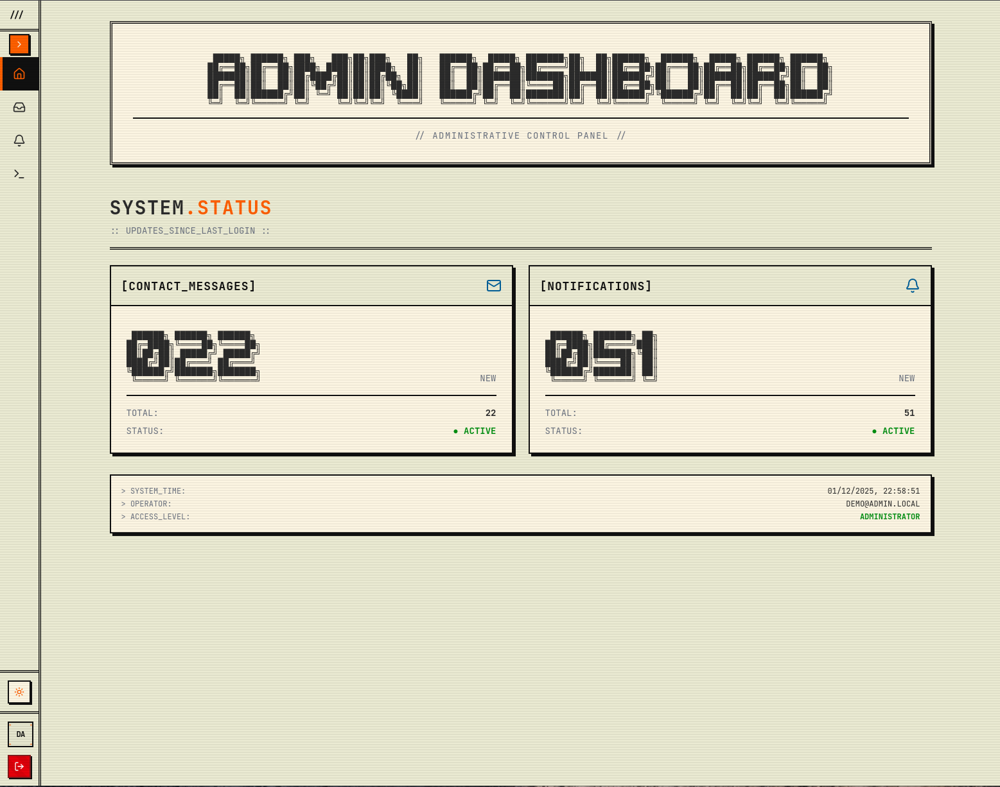

# Admin Dashboard Demo



### [Live demo version](https://admin-demo.kgdev.me/)

I made this admin dashboard for two reasons.

1. I needed a dashboard to track contact-us messages and notifications.
2. I wanted to create something in a kind of cassette futurism style.

I have a live version of this that connects to my real contact-us and notifications APIs for [Quest-Lock](https://quest-lock.com/) but wanted to share the dashboard separately as it is pretty cool.

This version uses a mock API and generated data to approximate what the real thing looks like.

My production contact-us API is a basic CRUD API, written in Rust and hosted on Cloudflare Workers. It uses a D1 database for storage.

My production notification service is an event sourced CQRS API, also written in Rust, and hosted across several Cloudflare Workers. The event stream for each notification is stored in its own Durable Object and events are projected from the Durable Object to the central read model databases (D1) asynchronously. 

## Getting Started

Install dependencies:
```bash
npm install
```

Run development server:
```bash
npm run dev
```

Build for production:
```bash
npm run build
```

Preview production build:
```bash
npm run preview
```

## Development

Run linter:
```bash
npm run lint
```

Check types:
```bash
npm run typecheck
```

Format code:
```bash
npm run format
```

## Notes

- All API endpoints are mocked via fetch interceptor
- Data is regenerated on each page reload
- No data persistence between sessions
- Console logs are included for debugging mock API calls
